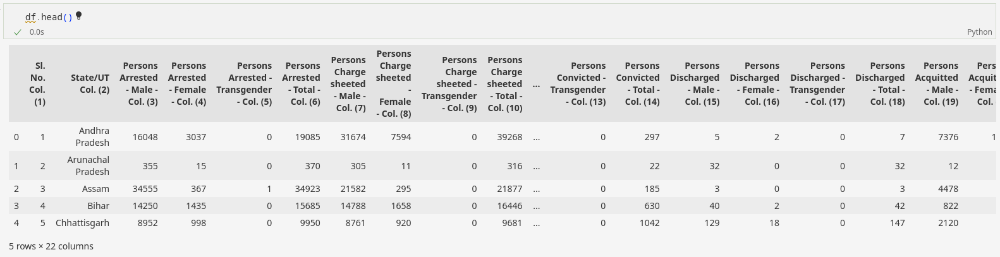
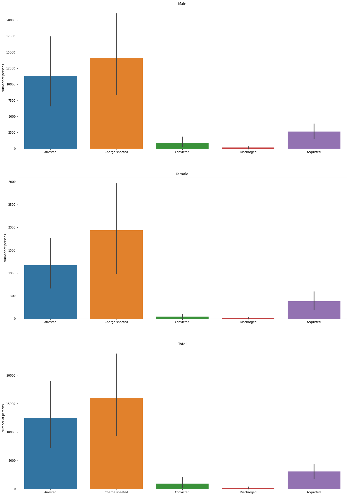
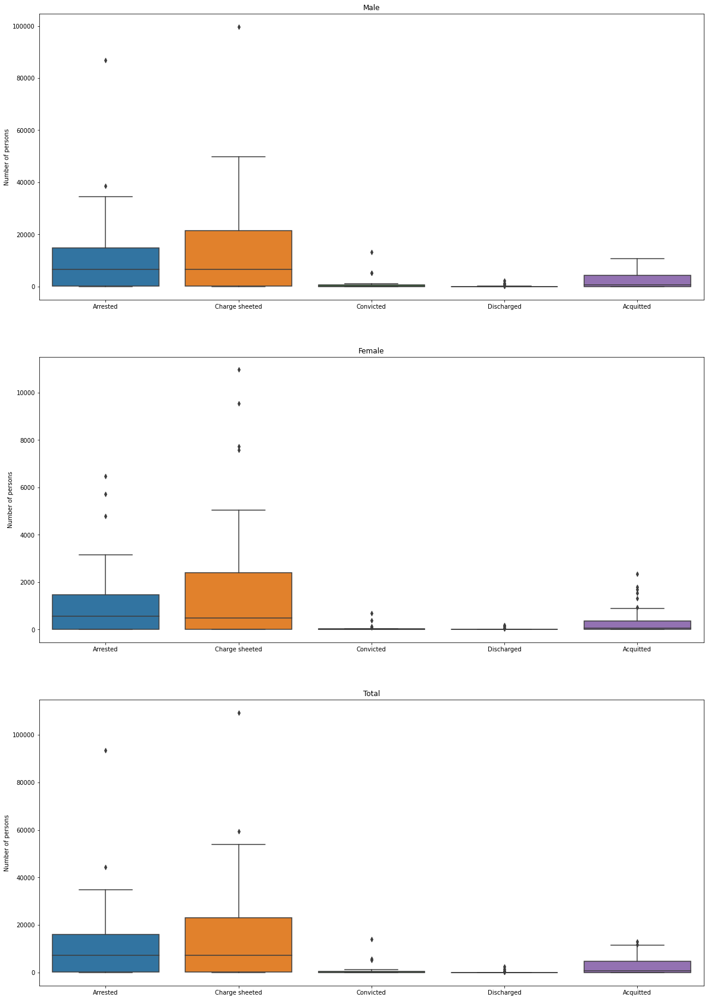
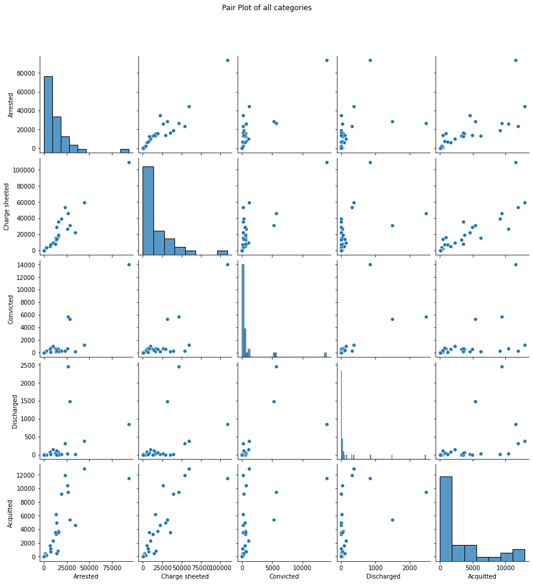

## Data
This data contains statewise gender specific number of persons arrested, charge-sheeted, convicted, discharged and acquitted.

**Genders**: Male, Female, Transgender

### Accused Statuses
- **Arrested**: Seized by legal authority and taken into custody
- **Charge-Sheeted**: Charges are framed on the accused by the magistrate
- **Convicted**: Accused has been declared guilty
- **Discharged**: Not enough grounds to lead the proceedings against the accused
- **Acquitted**: Accused is not guilty of the offence

## Bar Plot

Here we are plotting the data of number of people in each category for **male**, **female** and **total**. 

For data with different categories, a bar graph is execellent for displaying the data.

From the bar plots below we can see that out of the large number of people charge sheeted, most are arrested and out of which majority are acquitted due to lack of evidence. The actual percentage of people actually punished (convicted) is very low.

## Box Plot

Here we are plotting the data of number of people in each category for **male**, **female** and **total**. 

Box plot displays a summary of a large amount of data in five numbers. These numbers include the median, upper quartile, lower quartile, minimum and maximum data values. It gives a clear summary and also displays outliers.

From the box plots below we can see that the data is skewed towards the lower quartile and hence the data above the upper quartile can be ignored and can be considered as outliers.

## Pair Plot

Here we are plotting the data of number of people in each category of the accused.

Pair plot is used to understand the best set of features to explain a relationship between two variables or to form the most separated clusters

From the pair plot below we can see that the features with high correlation are (Arrested, Charge sheeted) and (Charge sheeted, Acquitted)

