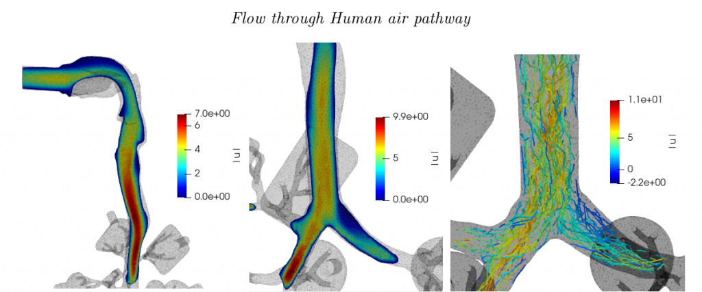

### 1. SimInhale : Particle deposition on human air pathway using Turbulence Modelling

This project involves modelling of the turbulent fluid flow in the human air pathway geometry using Turbulence modelling methods and then coupling them with the Lagrangian approach of tracking particles in that fluid flow to identify the deposition patterns (fractions) in within the geometry.

<!--  -->

<iframe width="600" height="450" src="./images/siminhale-50K.mp4" frameborder="0" allow="autoplay; encrypted-media" allowfullscreen></iframe> 

### 2. Semi-autonomous, gesture controlled robot for finding path in a maze.

  - Constructed a semi-autonomous gesture controlled robot using an Atmega16 microcontroller.
  - The gestures were determined by an accelerometer and a magnetometer.
  - Omni drive was used for movement, sonar for detecting walls and servo for rotation of sonar.

### 3. Uncovering nucleus of large networks

  - Implemented the paper 'Uncovering nucleus of social networks' by Braulio Dumbo, Zhi-Li Zhang in python using the NetworkX library.
  - Tested it on different sets of data and compared with degree, eigenvector, betweenness and closeness centrality.

### 4. Software to determine coal outsourcing price for e-reverse-auctioning

  - Developed a software to determine coal outsourcing price for various inputs.
  - It calculates the minimum sustainable price at which the project can be fulfilled taking in account all the hazards that can happen and also the cost of its closure.
  - This will prevent companies from auctioning for an unsustainable value and face problems in the future.
